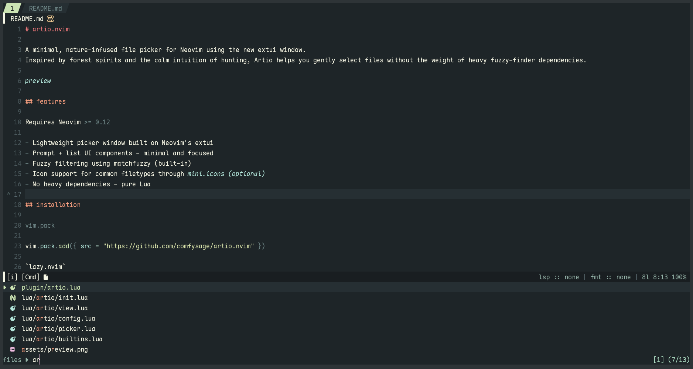

# artio.nvim

A minimal, nature-infused file picker for Neovim using the new extui window.
Inspired by forest spirits and the calm intuition of hunting, Artio helps you gently select files without the weight of heavy fuzzy-finder dependencies.



## features

Requires Neovim `>= 0.12`

- Lightweight picker window built on Neovim's extui
- Prompt + list UI components - minimal and focused
- Fuzzy filtering using matchfuzzy (built-in)
- Icon support for common filetypes through [mini.icons](https://github.com/echasnovski/mini.nvim) _(optional)_
- No heavy dependencies - pure Lua

### extui

artio requires the extui to be enabled.

an example of how to set this up is:

```lua
require("vim._extui").enable({ enable = true, msg = {
  target = "msg",
} })
```

## installation

`vim.pack`

```lua
vim.pack.add({{ src = "https://github.com/comfysage/artio.nvim" }})
```

`lazy.nvim`

```lua
{
  "comfysage/artio.nvim", lazy = false,
}
```

## configuration

```lua
require("artio").setup({
  opts = {
    preselect = true, -- whether to preselect the first match
    bottom = true, -- whether to draw the prompt at the bottom
    shrink = true, -- whether the window should shrink to fit the matches
    promptprefix = "", -- prefix for the prompt
    prompt_title = true, -- whether to draw the prompt title
    pointer = "", -- pointer for the selected match
    use_icons = true, -- requires mini.icons
  },
  win = {
    height = 12,
    hidestatusline = false, -- works best with laststatus=3
  },
  -- NOTE: if you override the mappings, make sure to provide keys for all actions
  mappings = {
    ["<down>"] = "down",
    ["<up>"] = "up",
    ["<cr>"] = "accept",
    ["<esc>"] = "cancel",
    ["<tab>"] = "mark",
    ["<c-l>"] = "togglepreview",
    ["<c-q>"] = "setqflist",
    ["<m-q>"] = "setqflistmark",
  },
})

-- override built-in ui select with artio
vim.ui.select = require("artio").select

vim.keymap.set("n", "<leader><leader>", "<Plug>(artio-files)")
vim.keymap.set("n", "<leader>fg", "<Plug>(artio-grep)")

-- smart file picker
vim.keymap.set("n", "<leader>ff", "<Plug>(artio-smart)")

-- general built-in pickers
vim.keymap.set("n", "<leader>fh", "<Plug>(artio-helptags)")
vim.keymap.set("n", "<leader>fb", "<Plug>(artio-buffers)")
vim.keymap.set("n", "<leader>f/", "<Plug>(artio-buffergrep)")
vim.keymap.set("n", "<leader>fo", "<Plug>(artio-oldfiles)")
```
